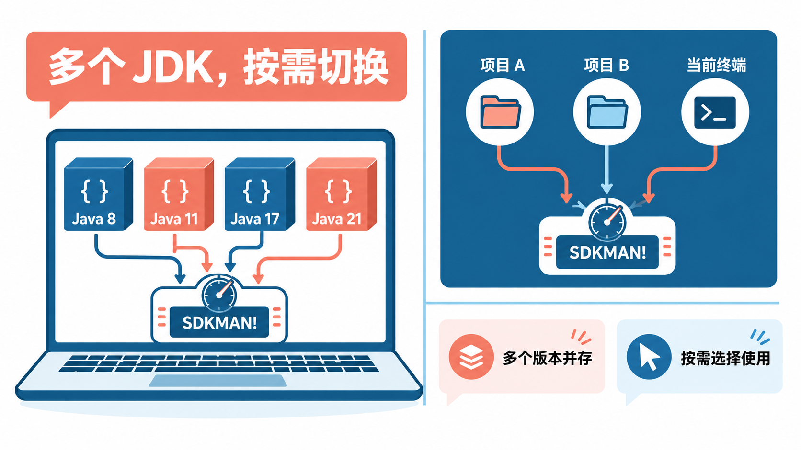
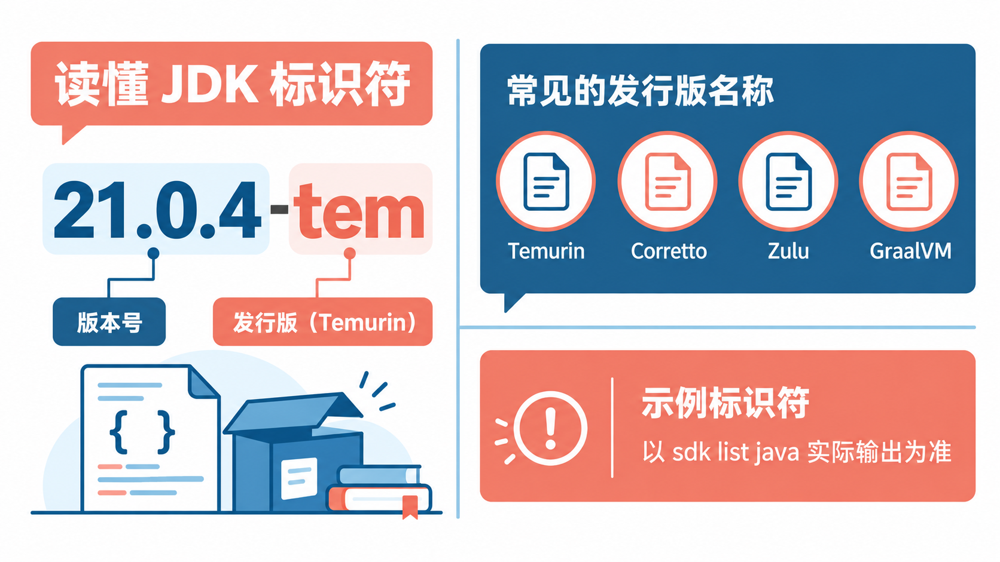
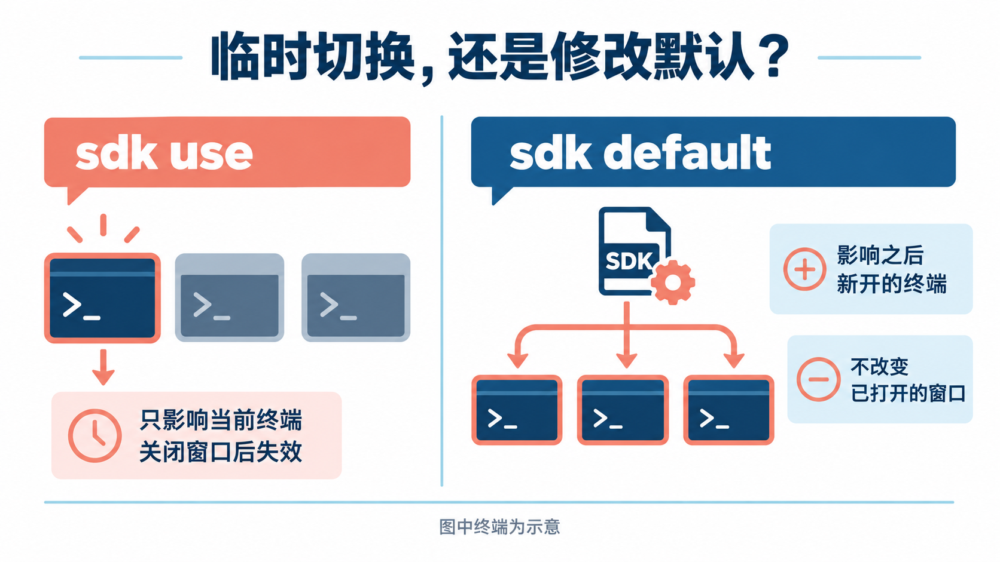
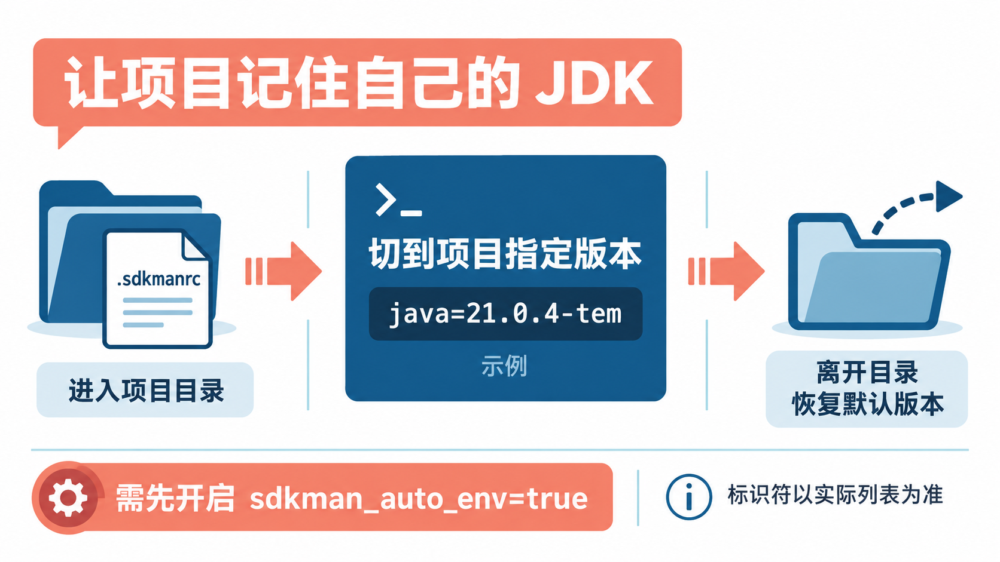

# 一台电脑装多个JDK，用SDKMAN一条命令切换Java版本

写 Java 久了，迟早会遇到这种情况：公司老项目还跑在 Java 8 或 11 上，新项目要 17 或 21，自己想试试新版本的特性，又得再装一个。几个 JDK 装在电脑里，`JAVA_HOME` 改来改去，一不小心就编译报错，还得回头查到底用的是哪个版本。

这篇介绍一个专门解决这件事的工具：**SDKMAN!**。看完你能做到三件事：用一条命令装好 JDK、在不同版本之间随时切换、让每个项目自动用上它自己需要的版本。

## SDKMAN 是什么，适合谁

SDKMAN（官方写作 SDKMAN!）是一个命令行工具，用来**在同一台电脑上并行管理多个版本的开发工具包**。它是开源项目，采用 Apache 2.0 许可证，免费使用。

它管的不只是 JDK。按官方说明，SDKMAN 面向的是整个 JVM 生态，Maven、Gradle、Spring Boot CLI、Groovy、Scala、Kotlin 这类工具也能用同一套命令安装和切换。Java 发行版这一块，Temurin、Corretto、Zulu、GraalVM 等都由官方从 Foojay 的接口自动同步进来，不用你去各家官网分别下载。

**适合谁：** 用 macOS 或 Linux 做 Java 开发、手上不止一个项目的人；或者经常在服务器上装 JDK、希望步骤统一的人。Windows 用户也能用，但需要借助 WSL，下面会单独说。

**不太适合谁：** 如果你只写一个项目、只用一个 JDK 版本，而且一直没遇到过版本冲突，那现在的安装方式就够用，不必为了“工具多一个”去折腾。



## 第一步：安装 SDKMAN

SDKMAN 依赖 bash 环境运行，官方文档说明它支持 macOS、Linux，以及装了 WSL 的 Windows，Bash 和 Zsh 两种 shell 都可以。

安装前确认系统里有 `curl`、`zip`、`unzip` 这几个基础工具。Ubuntu / Debian 上可以先补齐：

```bash
sudo apt install -y curl zip unzip
```

然后打开一个新终端，执行官方安装命令。用 bash 的：

```bash
curl -s "https://get.sdkman.io" | bash
```

用 zsh 的（macOS 新版本默认就是 zsh）：

```bash
curl -s "https://get.sdkman.io" | zsh
```

按屏幕提示走完。安装结束后，**重新开一个终端**，或者在当前终端里执行：

```bash
source "$HOME/.sdkman/bin/sdkman-init.sh"
```

最后确认装好了：

```bash
sdk version
```

能看到类似 `SDKMAN!`，下面跟着 `script` 和 `native` 两行版本号，就说明安装成功。具体版本号会随更新变化，不用和别人的一模一样。

**Windows 用户怎么办？** 官方的说法很明确：SDKMAN 不能在 Windows 上原生安装，需要先装 WSL（Windows Subsystem for Linux），然后在 WSL 的终端里按上面的 Linux 步骤操作，多数情况下直接就能用。官方也提到 Git Bash 配合 MinGW 的方式，但承认会有一些问题；Cygwin 已经不再支持。我的建议是：**Windows 上优先走 WSL**，省心很多。

## 第二步：挑一个 JDK 装上

先看看有哪些 JDK 可以装：

```bash
sdk list java
```

这里会列出各家发行版和它们的版本。你需要关注的是每个版本对应的**标识符**，形如 `21.0.4-tem`：前面是版本号，后面的短后缀代表发行版，比如 `tem` 就是 Eclipse Temurin。列表比较长，可以慢慢往下翻。

如果不在意具体版本，直接装官方当前推荐的稳定版：

```bash
sdk install java
```

下载安装完，它会问你要不要把这个版本设为**默认**：

```text
Do you want java 21.0.4-tem to be set as default? (Y/n):
```

直接回车就是“是”，之后新开的每个终端都会用这个版本。

想装指定版本，就把标识符写在后面。下面的标识符只是示例，**请换成你在 `sdk list java` 里实际看到的那个**：

```bash
sdk install java 21.0.4-tem
```

再装一个别的版本也是同样的命令，换个标识符即可。装好的 JDK 都放在 `~/.sdkman/candidates/java/` 下面，各自独立，互不覆盖。

**发行版怎么选？** 刚开始没有特别要求的话，选一个主流、免费的 OpenJDK 构建就行，比如 Temurin。公司或项目指定了发行版，就跟着项目走。各家的授权和支持政策不同，商用前以对应厂商官网为准。



## 第三步：在版本之间切换

这是 SDKMAN 最常用的两条命令，区别一定要分清。

**临时切换，只影响当前这个终端窗口：**

```bash
sdk use java 21.0.4-tem
```

关掉这个窗口，切换就失效了。适合临时验证“这段代码在另一个版本上能不能跑”。

**修改默认版本，影响之后打开的所有终端：**

```bash
sdk default java 21.0.4-tem
```

随时可以查当前用的是哪个版本：

```bash
sdk current java
java -version
```

`sdk current java` 会显示 SDKMAN 当前启用的版本，`java -version` 是 JDK 自己报的版本，两边对得上就没问题。

切换的时候，SDKMAN 会同时更新 `PATH` 和 `JAVA_HOME`，**你不需要再手动改环境变量**。这也是我觉得它最值得用的地方：以前容易出错的那一步，交给工具去做。

有些脚本或 IDE 需要填 JDK 的完整路径，可以用这条拿到：

```bash
sdk home java 21.0.4-tem
```

把输出的路径复制过去即可。



## 第四步：让项目自己记住要用哪个版本

手动 `sdk use` 还是要记住每个项目用哪个版本。更省事的办法是在项目根目录放一个 `.sdkmanrc` 文件。

先用 `sdk use` 切到这个项目需要的版本，然后在项目根目录执行：

```bash
sdk env init
```

它会生成一个 `.sdkmanrc`，内容大致是：

```text
# Enable auto-env through the sdkman_auto_env config
# Add key=value pairs of SDKs to use below
java=21.0.4-tem
```

文件里可以写多行 `key=value`，比如同时指定 Java 和 Maven 的版本。之后每次进入项目目录，执行：

```bash
sdk env
```

就会切到文件里写的版本。离开项目、想恢复默认版本时：

```bash
sdk env clear
```

**这个文件很适合提交到 Git 仓库里。** 别人拉下项目后，只要执行一次：

```bash
sdk env install
```

缺的 JDK 和工具会自动装上，团队里每个人用的版本就统一了。

**再进一步：进目录自动切换。** 执行 `sdk config` 会用系统编辑器打开配置文件 `~/.sdkman/etc/config`，把里面的这一项改成 `true`：

```text
sdkman_auto_env=true
```

保存后新开终端，以后 `cd` 进带 `.sdkmanrc` 的目录就会自动切版本，离开时自动恢复默认，连 `sdk env` 都不用敲了。



## 顺手管理 Maven 和 Gradle

同一套命令也能装构建工具，例如：

```bash
sdk install maven
sdk install gradle
```

具体有哪些工具可装，用 `sdk list` 查看完整列表（同样按 `q` 退出）。想知道哪些已安装的工具有新版本：

```bash
sdk upgrade
```

## 切了版本却没生效？先查这三处

**第一，是不是还在旧终端里。** 刚装完 SDKMAN、刚改过默认版本或配置文件，旧窗口不一定会跟着变。最简单的办法是关掉重开一个终端，再看 `sdk current java`。

**第二，初始化代码是不是在配置文件最后。** 安装程序会在 `~/.bashrc` 或 `~/.zshrc` 等文件末尾加一段加载 `sdkman-init.sh` 的代码，官方在这段代码上方特意注明它必须放在文件末尾。如果你后来又在它下面手动写了 `export JAVA_HOME=...` 或往 `PATH` 里加了别的 JDK，就可能把 SDKMAN 的设置覆盖掉。把这些旧的手动配置删掉或挪到它前面即可。

**第三，IDE 里用的是不是同一个 JDK。** 终端和 IDE 是两套设置，终端切了版本，IDE 里项目配置的 JDK 不会自动跟着变。在 IDE 的项目 JDK 设置里，把 `sdk home java 标识符` 输出的路径填进去就行。

## 日常维护的几条命令

**删掉不用的版本：**

```bash
sdk uninstall java 21.0.4-tem
```

**更新 SDKMAN 自己：**

```bash
sdk selfupdate
```

**刷新可安装的工具列表：** 提示“SDKMAN is out-of-date and requires an update”时，执行 `sdk update` 即可。

**清理本地缓存：** 用 `sdk flush`。官方特别提醒，**不要手动删除 `~/.sdkman/tmp` 这类目录**，会把 SDKMAN 弄坏。

**电脑里本来就装了 JDK？** 可以用 `sdk install java 自定义名字 JDK所在路径` 把它登记进 SDKMAN 统一切换。自定义名字不能和列表里已有的标识符重名，删除这种本地版本时也不会删掉原来的文件。

**网络慢、每次启动有停顿？** SDKMAN 启动时会检查能否连上它的服务。网络不稳定时，可以在配置文件里设置 `sdkman_healthcheck_enable=false` 跳过这一步，需要联网的命令到时还是会正常报错提示。

## 不想用了怎么卸载

官方给的卸载方式是两步：先删掉 SDKMAN 目录（里面装的 JDK 会一起删除，需要的话先备份）：

```bash
rm -rf ~/.sdkman
```

再打开 `~/.bashrc`、`~/.bash_profile`、`~/.profile` 或 `~/.zshrc`，删掉文件末尾那段带 `sdkman-init.sh` 的初始化代码，重新开终端就干净了。

## 写在最后

如果你现在电脑上只有一个 JDK，可以先装 SDKMAN，把现有项目用的版本装进来，再给每个项目放一个 `.sdkmanrc`。**以后遇到“这个项目要换 Java 版本”，就是一条命令的事。** 先从 `sdk list java` 开始看看，挑一个装上试试。

## 参考资料

<div class="sources">
<p>安装与卸载：<a href="https://sdkman.io/install">SDKMAN! 官方安装文档</a>。命令用法与配置项：<a href="https://sdkman.io/usage">SDKMAN! 官方使用文档</a>。JDK 发行版来源说明：<a href="https://sdkman.io/vendors">SDKMAN! Vendors 页面</a>。项目源码与许可证：<a href="https://github.com/sdkman/sdkman-cli">sdkman-cli（GitHub）</a>、<a href="https://github.com/sdkman/sdkman.github.io">SDKMAN! 官网源码（GitHub）</a>。</p>
<p>资料核对于 2026 年 10 月 10 日，依据为 SDKMAN! 官网文档源码的当时版本。文中命令来自官方文档，作者未在本文写作时实际运行；JDK 版本标识符（如 21.0.4-tem）为官方文档中的示例，可安装的版本会随时间变化，以 <code>sdk list java</code> 的实际输出为准。各 JDK 发行版的授权与商用政策以对应厂商官网为准。配图为示意图，不是真实终端截图。</p>
</div>
