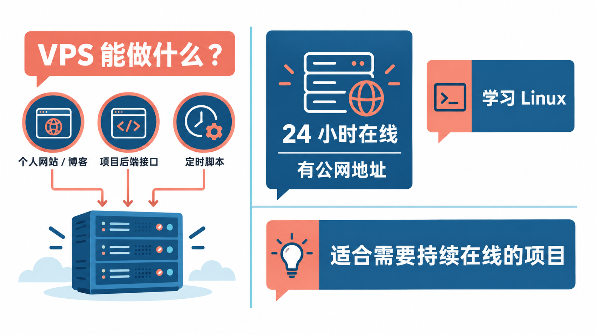
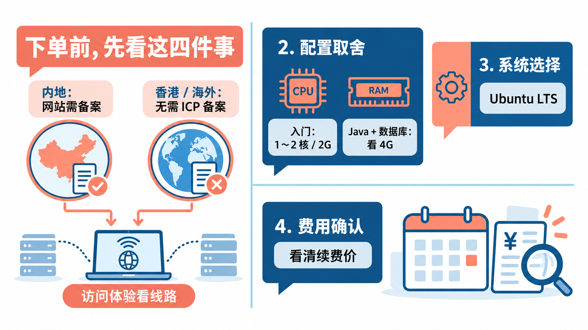
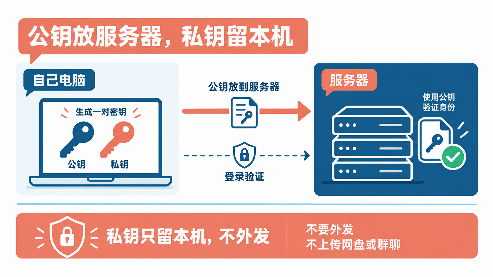
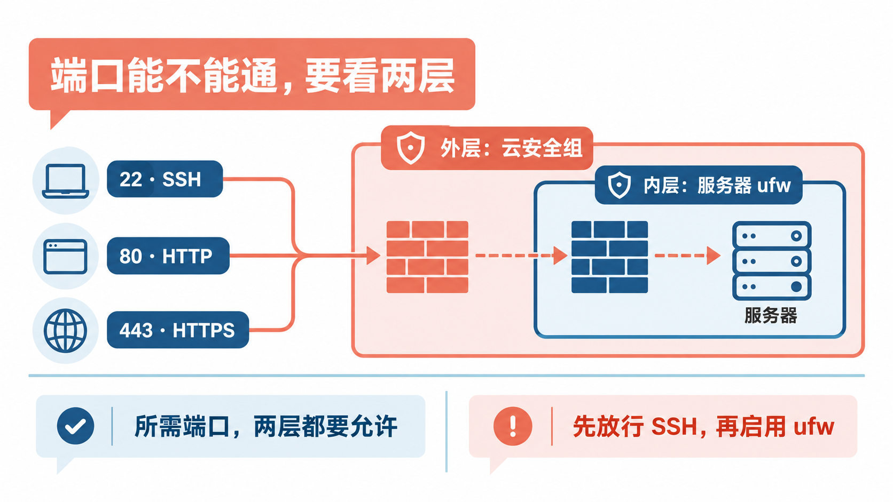
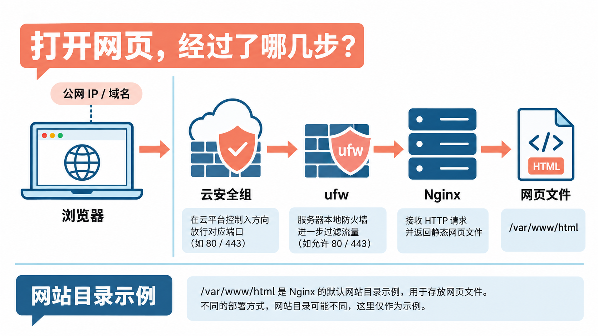

# 第一次租VPS：从下单到打开自己的网页

想自己搭个博客、部署一个练手项目，或者单纯想正经学学 Linux，很多人都会走到这一步：**租一台 VPS**。

先说一个容易误会的地方：VPS 不用自己“搭”。它是云服务商切出来、租给你用的一台虚拟服务器，下单几分钟就能拿到。真正需要你动手的，是拿到之后的那几步：**安全地登录上去，把基础防护做好，再让它跑起一个网页。**

这篇就按这个顺序走一遍。命令都以 Ubuntu 为例，照着敲就行，不需要提前懂太多 Linux。

## VPS 到底能拿来干什么？



可以把它理解成一台**放在机房、24 小时开机、有公网地址**的电脑。你的笔记本合上盖子就“下线”了，VPS 不会。

所以它适合那些需要一直在线、别人能访问到的事情：个人网站或博客、小程序和 App 的接口后端、每天定时跑的脚本、写好的 Java 项目想部署出去给朋友看看。顺带着，它也是练 Linux 命令最直接的地方，弄坏了大不了重装系统。

反过来，如果你只是想写代码、跑跑本地测试，自己电脑就够了，没必要为了“有台服务器”先花一笔钱。**先想清楚要用它做什么，后面的选择会简单很多。**

## 下单前，先想好这几件事



**第一，服务器放国内还是海外。** 这是最影响后续操作的一项。按照阿里云帮助文档的说明，网站部署在中国内地的服务器上，就需要先完成 ICP 备案，未备案的域名解析到内地服务器会被阻断访问；备案成功、网站开通后，还要在 30 日内办理公安联网备案。其他云厂商的内地服务器同样需要备案，具体流程问对应厂商。

海外和中国香港地区的服务器不需要 ICP 备案，开通就能用域名访问，代价是从国内访问的速度和稳定性通常不如内地机房。我的建议是：**网站主要给国内用户看、愿意花时间走备案，就选内地；只是自己学习或者想尽快上线，可以先选香港或海外。**

**第二，配置不用一步到位。** 学习、放个静态网站，入门的 1～2 核、2G 内存一般就够。要跑 Spring Boot 这类 Java 项目再加上数据库，内存最好往 4G 看，Java 程序比较吃内存。后面不够再升配，多数云厂商都支持。

**第三，系统选 Ubuntu 的 LTS 版本。** LTS 是长期支持版，按 Ubuntu 官方的发布周期，24.04 LTS 的标准安全维护到 2029 年 5 月，26.04 LTS 到 2031 年 5 月。新手资料最多的也是 Ubuntu，遇到问题好搜。

**第四，看清续费价。** 很多新用户活动的首年价格很低，续费价可能差得比较多，下单前在购买页把续费价看清楚。另外，到期没续费，服务器一段时间后可能被释放，里面的数据就找不回了，具体规则以各家服务商为准。

下单时如果页面上有“密钥对”选项，可以直接创建或导入一个，后面能省一步。没有也没关系，先用密码，下面会改。

## 第一次登录：用 SSH 连上去

买好以后，在云控制台找到这台服务器的**公网 IP** 和**登录用户名**。用户名常见的是 `root` 或 `ubuntu`，以控制台显示的为准。

Mac 打开“终端”，Windows 打开 PowerShell，输入：

```bash
ssh root@你的公网IP
```

第一次连接会问你是否信任这台主机，输入 `yes` 回车，再输入密码。输入密码时屏幕上不会显示任何字符，这是正常的，输完直接回车。

Windows 10（1809 及以后版本）和 Windows 11 可以安装系统自带的 OpenSSH 客户端，很多电脑已经装好。如果提示找不到 `ssh` 命令，在“设置 → 可选功能”里添加“OpenSSH 客户端”即可。

看到命令行提示符变成服务器的名字，就说明你已经进到 VPS 里了。

## 把密码登录换成密钥登录



服务器一开机就暴露在公网上，用密码登录，等于让任何人都能来试你的密码。**换成密钥登录，是新服务器最值得先做的一件事。**

原理不复杂：在自己电脑上生成一对密钥，**公钥**放到服务器上，**私钥**留在自己电脑里。登录时两边一对，对上了才放行，不用再输密码。

在**自己电脑**上运行（不是服务器里）：

```bash
ssh-keygen -t ed25519 -C "my-vps"
```

一路回车用默认位置就行，中途让你设的 passphrase 是给私钥再加一道密码，想加就加。

然后把公钥传到服务器。Mac 和 Linux 用这条：

```bash
ssh-copy-id root@你的公网IP
```

Windows 没有 `ssh-copy-id`，在 PowerShell 里用这条代替：

```powershell
type $env:USERPROFILE\.ssh\id_ed25519.pub | ssh root@你的公网IP "mkdir -p ~/.ssh && chmod 700 ~/.ssh && cat >> ~/.ssh/authorized_keys && chmod 600 ~/.ssh/authorized_keys"
```

传完再执行一次 `ssh root@你的公网IP`，如果不用输服务器密码就进去了，说明密钥生效。

**私钥文件（没有 .pub 后缀的那个）只留在自己电脑上**，别发给别人，也别上传到网盘或群里。

## 别一直用 root：建一个自己的用户

`root` 是权限最高的账号，什么都能改，误操作的代价也最大。日常用一个普通用户，需要管理员权限时再加 `sudo`，会稳妥很多。

如果你的服务器默认用户已经是 `ubuntu` 这种普通用户，这一步可以跳过。如果是 `root` 登录的，在服务器里运行（把 `xiaotuan` 换成你想要的用户名）：

```bash
adduser xiaotuan
usermod -aG sudo xiaotuan
rsync --archive --chown=xiaotuan:xiaotuan ~/.ssh /home/xiaotuan
```

第一行会让你给新用户设密码，这个密码之后用 `sudo` 时要输。第三行是把刚才的公钥也复制给新用户，这样它也能用密钥登录。

**先别关当前窗口**，新开一个终端试试：

```bash
ssh xiaotuan@你的公网IP
sudo whoami
```

最后一行输出 `root`，说明新用户能正常使用管理员权限。后面的操作都用这个新用户来做。

## 三件安全小事，花十分钟做完

**第一件，更新系统。**

```bash
sudo apt update && sudo apt upgrade -y
```

新装的系统往往不是最新补丁，先更新一遍。以后也隔一段时间跑一次。

**第二件，关掉密码登录和 root 远程登录。** 密钥已经能用了，密码登录这条路就可以关掉：

```bash
sudo tee /etc/ssh/sshd_config.d/01-hardening.conf > /dev/null <<'EOF'
PasswordAuthentication no
PermitRootLogin no
EOF
sudo sshd -t
sudo systemctl reload ssh
```

文件名开头的 `01` 有用意。部分云厂商的 Ubuntu 镜像会在同一个目录里放一个开启了密码登录的配置文件（比如 `50-cloud-init.conf`）。SSH 读取这些文件时按文件名顺序，同一项设置以先读到的为准，所以我们的文件要排在前面。

改完用这条检查实际生效的结果：

```bash
sudo sshd -T | grep -E 'passwordauthentication|permitrootlogin'
```

两项都显示 `no` 就对了。**这一步一定要保留当前已登录的窗口，新开一个窗口测试能不能用新用户登录**，确认没问题再关旧窗口。万一配错把自己锁在外面，多数云控制台还有“远程连接/VNC”可以救急。

**第三件，开防火墙。** 这里有两层，容易漏掉其中一层：



外层是云控制台里的**安全组**（有的厂商叫“防火墙”），在网页上配置，决定哪些端口能从外面进来。一般默认放行 22 端口，后面要建网站，再加上 80 和 443。

内层是服务器自己的防火墙，Ubuntu 上用 `ufw`：

```bash
sudo ufw allow OpenSSH
sudo ufw enable
sudo ufw status
```

**顺序不能反：先放行 SSH，再启用防火墙。** 反过来的话，启用那一刻就会把自己挡在外面。

## 上线第一个网页



装一个 Nginx，它负责把网页发给访问的人：

```bash
sudo apt install -y nginx
sudo ufw allow 'Nginx Full'
```

`Nginx Full` 会同时放行 80 和 443 端口。别忘了去云控制台的安全组里，也把这两个端口加上。

现在在浏览器里打开 `http://你的公网IP`，看到 “Welcome to nginx!”，说明网页已经能从外网访问了。

换成自己的内容也很简单，网页文件默认放在 `/var/www/html/`：

```bash
echo '<h1>Hello，这是我的第一台服务器</h1>' | sudo tee /var/www/html/index.html
```

刷新浏览器，就能看到自己写的这行字。之后放博客、放前端项目打包出来的文件，也都是往这个目录里放。

如果打不开，按这个顺序查：安全组有没有放行 80 端口 → `sudo ufw status` 里有没有 Nginx → `systemctl status nginx` 是不是 running。大部分问题出在第一步。

## 想用域名和 HTTPS？

用 IP 访问能跑通，下一步通常是绑定域名、加上 HTTPS 小锁。

先在域名服务商那里加一条 **A 记录**，指向你的公网 IP。**服务器在内地的话，这一步之前要先完成备案。**

然后告诉 Nginx 你的域名。打开 `/etc/nginx/sites-available/default`，把 `server_name _;` 改成 `server_name 你的域名;`，保存后检查并重载：

```bash
sudo nginx -t
sudo systemctl reload nginx
```

HTTPS 证书用免费的 Let's Encrypt，通过 Certbot 申请。按 Certbot 官方说明，Ubuntu 上用 snap 安装：

```bash
sudo snap install --classic certbot
sudo ln -s /snap/bin/certbot /usr/local/bin/certbot
sudo certbot --nginx
```

按提示填邮箱、选域名，它会自动申请证书并改好 Nginx 配置。证书有有效期，Certbot 装好后会自带自动续期任务，可以用这条确认续期能正常运行：

```bash
sudo certbot renew --dry-run
```

## 用起来之后，记得这几件事

**定期做快照或备份。** 多数云厂商的控制台都有快照功能（可能单独收费），在大改配置之前打一个，出了问题能回滚。重要数据别只放在一台服务器上。

**留意到期和续费。** 设个日历提醒，别等服务器被释放了才想起来。

**保管好登录方式。** 私钥、云账号密码都别外发；云账号本身最好也打开二次验证，控制台能直接重置服务器，比 SSH 更要紧。

**遵守服务商的使用条款。** 服务器在你名下，上面跑的东西也由你负责。

做到这里，你手上就有了一台能安全登录、能对外提供网页的服务器。**接下来想放博客、部署自己的 Java 项目，都是在这个基础上往上加。** 第一次不必追求一步配完美，先把今天这几步走通，就是个不错的开始。

## 参考资料

<div class="sources">
<p>备案要求：<a href="https://help.aliyun.com/zh/icp-filing/basic-icp-service/user-guide/icp-filing-application-overview">阿里云 ICP 备案流程概述</a>、<a href="https://help.aliyun.com/zh/icp-filing/basic-icp-service/getting-started/quick-start-for-icp-filing-for-personal-websites">个人网站 ICP 备案</a>、<a href="https://help.aliyun.com/zh/icp-filing/basic-icp-service/product-overview/faq-about-icp-filing-applications-in-different-scenarios">不同场景下的备案常见问题</a>。</p>
<p>系统支持周期：<a href="https://ubuntu.com/about/release-cycle">Ubuntu 官方发布周期</a>。Windows SSH：<a href="https://learn.microsoft.com/zh-cn/windows-server/administration/openssh/openssh_install_firstuse">Microsoft OpenSSH 说明</a>。HTTPS 证书：<a href="https://certbot.eff.org/instructions?ws=nginx&os=snap">Certbot 官方安装说明</a>。SSH 配置优先级见 OpenSSH 的 sshd_config 手册。</p>
<p>资料核对于 2026 年 10 月 10 日。文中命令来自官方文档，写作时未实际运行。命令以 Ubuntu 24.04/26.04 LTS 为例，不同云厂商的控制台入口、默认用户名和镜像配置可能不同，以实际页面为准；价格以购买页为准。配图为示意图，不是控制台截图。</p>
</div>
